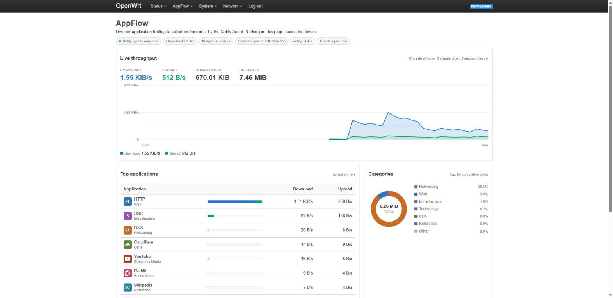
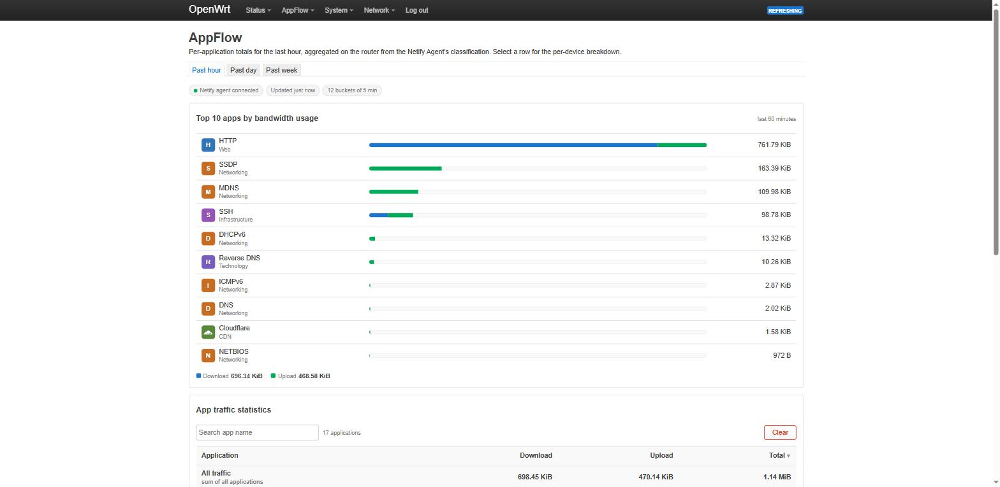

# luci-app-appflow

**Real-time per-application traffic visibility for OpenWrt.**

`appflow` answers the question stock OpenWrt cannot: *what is my network doing
right now, by application?* Netflix vs. YouTube vs. a Windows update, broken
down per device, live in LuCI — the kind of DPI dashboard normally reserved
for vendor firmware, built entirely on open components.

> Status: **in development** — not yet ready for use.

## How it works

    netifyd (DPI engine, nDPI-based)
        │  JSON flow events (unix socket)
        ▼
    appflowd (ucode daemon: aggregates flows → apps × devices)
        │  ubus
        ▼
    LuCI view (hand-drawn inline SVG charts, live polling)

## Screenshots

Live overview:

Statistics (past hour):

## Install

    apk update
    apk install luci-app-appflow

`luci-app-appflow-icons` is an optional, separately-installable package that
adds brand icons for the applications netifyd can detect; without it the
dashboard renders letter-tile avatars instead. Install it separately if you
want it:

    apk install luci-app-appflow-icons

## License

Apache-2.0 — see [LICENSE](LICENSE).
